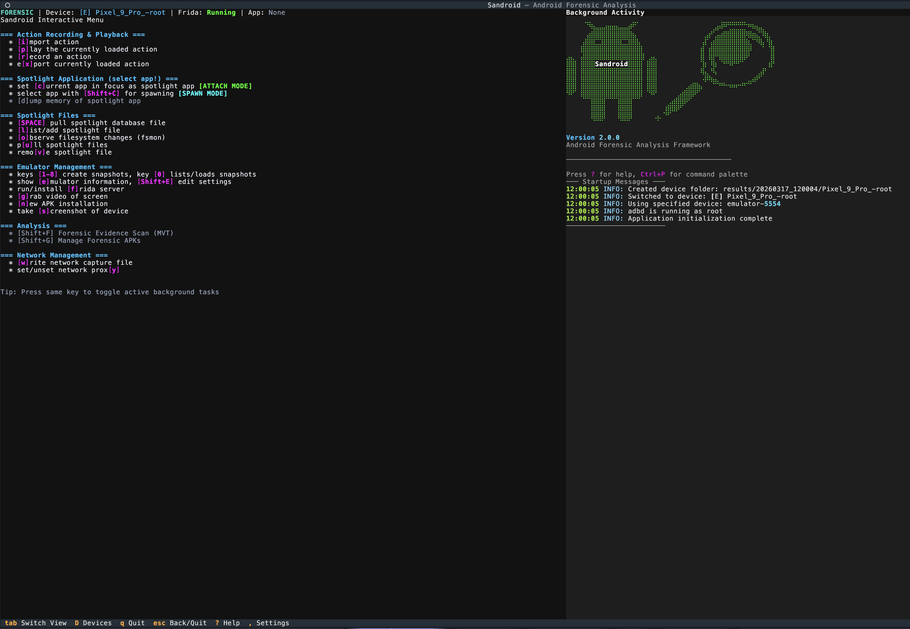
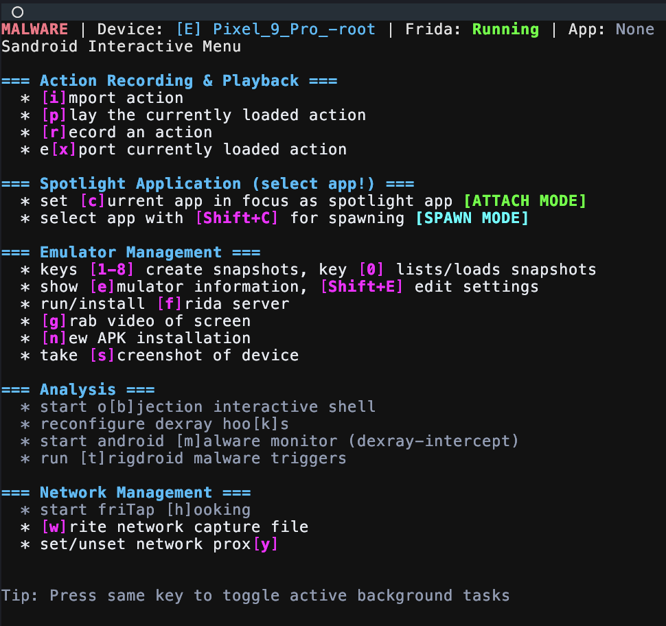
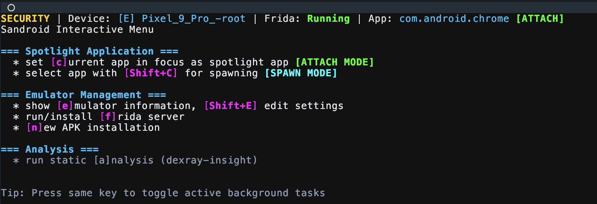

<div align="center">
    
    <p></p><strong>Android Sandbox for Automated Forensic, Malware, and Security Analysis</strong></div></p>
</div>

# Sandroid Framework
 [](https://badge.fury.io/py/Sandroid)
[](https://github.com/fkie-cad/Sandroid_core/actions/workflows/lint.yml)
[](https://github.com/fkie-cad/Sandroid_core/actions/workflows/publish.yml)


Sandroid provides a powerful **Android sandbox framework** that enables automated analysis of Android applications.
It combines both **static** and **dynamic** techniques to help security researchers, forensic analysts, and malware analysts better understand how apps behave in a controlled environment.

By using this framework, you can:

- **Extract forensic artifacts** generated by Android apps and identify which app created them.
- **Analyze malware behavior** through automated static and dynamic analysis.
- **Uncover security vulnerabilities** and misconfigurations in Android applications.
- Gain deeper insights into app behavior without manual reverse engineering.

The framework is designed to simplify the process of **forensic investigations**, **mobile threat detection**, and **security testing** by providing a streamlined, automated environment for analysis.
Whether you're investigating malicious apps, assessing security flaws, or collecting digital evidence, this solution helps you quickly identify and understand what happens inside Android applications.

## Three Analysis Views

Sandroid's TUI provides three specialized analysis views, each tailored to a different use case:

| View | Purpose | Status |
|------|---------|--------|
| **Forensic** | Extract and analyze forensic artifacts from Android apps | Stable |
| **Malware** | Behavioral analysis, hooking, and malware monitoring | Stable |
| **Security** | Vulnerability scanning and security testing | Early Stage |

Switch between views using the `TAB` key in the TUI, or launch directly with `--view`:

```bash
sandroid --view forensic    # Start in forensic view
sandroid --view malware     # Start in malware view
sandroid --view security    # Start in security view
```

<p align="center">
  
</p>

## Quick Start

```bash
# Install from PyPI
pip install sandroid

# Initialize configuration
sandroid-config init

# Run analysis in interactive mode
sandroid
```

See [SETUP.md](SETUP.md) for all installation possibilities.

## Usage

```
Usage: sandroid [OPTIONS]

  Sandroid: Extract forensic and malware artifacts from Android Virtual Devices.

Core Options:
  -c, --config PATH               Configuration file path
  -e, --environment TEXT           Environment name (development, testing, production)
  -f, --file PATH                 Save output to the specified file
  -ll, --loglevel [DEBUG|INFO|WARNING|ERROR|CRITICAL]
                                  Set the log level
  --view [forensic|malware|security]
                                  Set the initial view mode
  -i, --interactive               Start in legacy Rich interactive mode
  --fresh                         Start as if running for the first time
  --version                       Show the version and exit

Analysis Options:
  -n, --number INTEGER            Run action n times (minimum 2)
  --avoid-strong-noise-filter     Disable dry run and intra-file noise detection
  --network                       Capture traffic and show connections
  -d, --show-deleted              Reveal deleted files via full filesystem checks
  --no-processes                  Do not monitor active processes
  --sockets                       Monitor listening sockets
  --screenshot INTERVAL           Take a screenshot each INTERVAL seconds
  --trigdroid PACKAGE_NAME        Execute malware triggers for PACKAGE_NAME
  --trigdroid-ccf [I|D]           TrigDroid CCF utility (I=interactive, D=default)
  --hash                          Create MD5 hashes of changed and new files
  --apk                           List all APKs and their hashes
  --degrade-network               Simulate UMTS/3G network conditions
  --whitelist FILE                Exclude paths from outputs

Headless Mode:
  --headless                      Run without interactive UI
  --batch CONFIG_FILE             Batch processing config (JSON)
  --mode [forensic|malware|security|network]
                                  Analysis mode for headless operation (default: malware)

Dexray & Advanced Tools:
  --dexray PACKAGE                Start Dexray-Intercept monitoring for PACKAGE
  --dexray-hooks HOOKS            Comma-separated hook groups (aes,web,socket,filesystem,database,dex,java_dex)
  --dexray-fritap                 Enable FriTap during dexray monitoring
  --fritap PACKAGE                Start FriTap SSL/TLS key extraction for PACKAGE
  --fridump PACKAGE               Dump memory of PACKAGE using Fridump
  --duration SECONDS              Network capture duration (headless, default: 60)
  --with-fritap PACKAGE           Combine network capture with FriTap keylog

Device Management:
  --proxy IP:PORT                 Set HTTP proxy on device
  --proxy-clear                   Clear HTTP proxy settings
  --install-apk PATH              Install APK on device
  --import-action PATH            Import action recording file
  --device-settings FILE          Apply device settings from JSON file
  --preset CODE                   Apply country preset (e.g., de, us, ru, cn)

Output & Debugging:
  --ai                            Enable AI-powered analysis and summarization
  --report                        Generate PDF report
  --debug                         Enable debug/verbose mode
  --log                           Show log messages in terminal
```


With its modular architecture, Sandroid integrates multiple companion tools to cover a wide range of analysis capabilities — from cryptographic key extraction to TLS interception and network traffic decryption.

### Related Projects within the Sandroid Sandbox

Sandroid integrates and builds upon several companion projects that extend its capabilities.
These tools are developed under the same sandbox ecosystem and are designed to work together for comprehensive Android analysis:

| Project | Description | Status |
|--------|------------|--------|
| [**TrigDroid**](https://github.com/fkie-cad/Sandroid_TrigDroid) | Dynamic tracing and Frida-based interception for Android apps, enabling enhanced runtime analysis. | ✅ Integrated |
| [**Dexray Insight**](https://github.com/fkie-cad/Sandroid_Dexray-Insight) | A static analysis tool focused on DEX files, helping to uncover cryptographic usage, API patterns, and potential vulnerabilities. | ✅ Integrated |
| [**Dexray Intercept**](https://github.com/fkie-cad/Sandroid_Dexray-Intercept) | Dynamic hooking framework for intercepting sensitive data flows, network traffic, and runtime behaviors in Android apps. | ✅ Integrated |
| [**friTap**](https://github.com/fkie-cad/friTap) | TLS key extraction and decrypted traffic interception for Android, enabling advanced network analysis in sandboxed environments. | ✅ Integrated |


# Ground Truth APK
The framework also includes a custom Android app for testing and calibration.
This app is designed to **create specific forensic artefacts with pinpoint accuracy** at the user's command, while being as minimal as possible to avoid unintended artefacts.
To use it, simply install it on the emulator using Sandroid's built-in APK installer and open the app.

## Supported Artefacts
In the current version, the ground truth app supports nine different artefacts
- Creating a new file
- Adding an entry to a Database
- Deleting an entry from a Database
- Updating an entry in a Database
- Sending a specific number of bytes to a specific URL
- Starting a specific process
- Adding an entry to a XML file
- Deleting an entry from a XML file
- Updating an entry in a XML file
Simply press the corresponding button to generate the Artefact

## Some considerations
- Values added to the XML file and the Database will be the current unix time on the emulator. It can deviate from the actual time but will be automatically be highlighted in the output.
- The first time the application is launched after installation, the XML file and database will be initialised, and Android will create a profile for the application, so **it is recommended that you open the application first, and only then start any analysis.**
- The XML and database files are called `GroundTruth.xml` and `GroundTruth.db` respectively and are stored in the applications directory.

## Documentation

- **[SETUP.md](SETUP.md)** - Complete setup guide for new installation method
- **[CHANGELOG.md](CHANGELOG.md)** - Detailed release notes and version history

## Installation Options

### Option 1: PyPI Installation (Recommended)
```bash
pip install sandroid
sandroid-config init
sandroid --help
sandroid # starting sandroid in interactive mode (default)
```

### Option 2: Legacy Installation (Still Supported)
```bash
git clone <repository>
./install-requirements.sh
./sandroid.legacy
```

## Configuration Management

The modern installation includes a powerful configuration system:

```bash
# Initialize configuration
sandroid-config init

# View configuration
sandroid-config show

# Modify settings
sandroid-config set analysis.monitor_network true
sandroid-config set emulator.device_name "Pixel_8_Pro_API_34"

# Validate configuration
sandroid-config validate
```

Configuration files are automatically discovered in standard locations:
- `~/.config/sandroid/sandroid.toml` (user config)
- `./sandroid.toml` (project-specific config)
- Environment variables with `SANDROID_` prefix

Supported formats: TOML, YAML, JSON (TOML preferred)

### sandroid-config Subcommands

```bash
# AVD Management
sandroid-config avd list          # List available AVDs
sandroid-config avd start         # Start an AVD (interactive or direct)
sandroid-config avd stop          # Stop running AVDs
sandroid-config avd rename        # Rename an AVD
sandroid-config avd create        # Create a new AVD

# TUI Theme
sandroid-config theme list        # List available themes
sandroid-config theme set <id>    # Set TUI theme
sandroid-config theme show        # Show current theme

# IOC Management (for MVT forensic scanning)
sandroid-config ioc show          # Show IOC configuration
sandroid-config ioc set-path <p>  # Set IOC file/directory path
sandroid-config ioc set-url <url> # Set IOC download URL
sandroid-config ioc download      # Download IOC files
sandroid-config ioc validate      # Validate IOC files

# Device Management
sandroid-config devices           # List connected devices
```

## Screenshots

<p align="center">
  
  <br><em>Forensic Analysis View</em>
</p>

<p align="center">
  
  <br><em>Malware Analysis View</em>
</p>

<p align="center">
  
  <br><em>Security View (Early Stage)</em>
</p>

## Contributing

We welcome contributions to Sandroid! Before contributing:

1. **Review Coding Guidelines**: Please read our comprehensive [CODING_GUIDELINES.md](CODING_GUIDELINES.md) which covers:
   - Python code style standards (PEP 8 compliance)
   - Architecture patterns specific to Sandroid
   - Testing requirements and best practices
   - Security considerations for forensic tools
   - Documentation standards

2. **Development Setup**:
   ```bash
   git clone git@github.com:fkie-cad/Sandroid_core.git
   cd Sandroid_core
   pip install -e .[dev]
   #pytest  # Run tests - right now we don't have any tests
   ```

3. **Submit Changes**: Fork the repository, create a feature branch, ensure tests pass, and submit a pull request.

For detailed contribution instructions, see [docs/development/contributing.rst](docs/development/contributing.rst).


## Contact

Developed and maintained by Fraunhofer FKIE.

For inquiries or collaboration, please contact:
- daniel.baier@fkie.fraunhofer.de.
- jan-niclas.hilgert@fkie.fraunhofer.de
